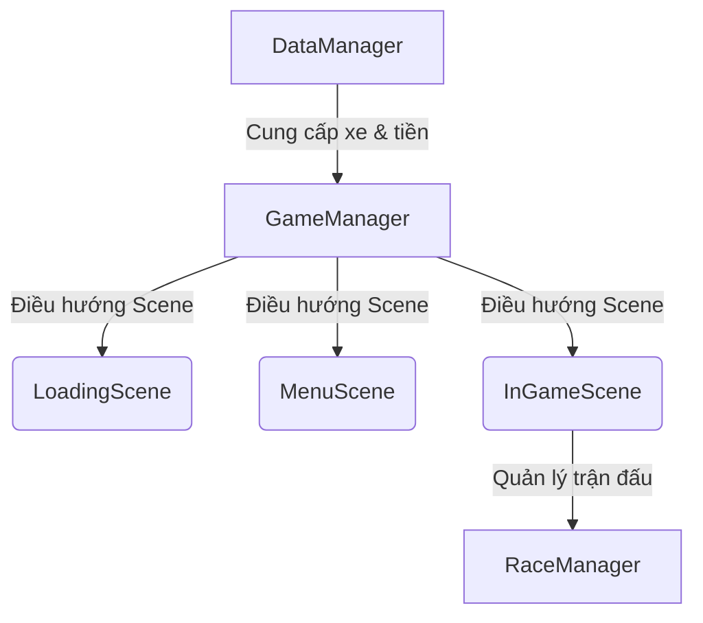

# Thiết Kế Hệ Thống Game Car Drift 
 Hệ thống được tổ chức xoay quanh 3 Scene chính như được định nghĩa trong  **LoadingScene**, **MenuScene**, **InGameScene** (GameScene).

---

## 1. Kiến Trúc Quản Lý Tổng Quan (Managers)

Để kết nối 3 Scene và điều phối dữ liệu một cách nhất quán, chúng ta sử dụng mô hình Manager tập trung (áp dụng Singleton có sẵn trong dự án tại [MonoSingleton.cs](file:///d:/WorkSpace/Unity/GameDev/Car-Drift/Assets/CarDrift/Scripts/CoreScript/Singleton/MonoSingleton.cs)):



* **`DataManager`**: Chịu trách nhiệm lưu trữ và đọc dữ liệu người chơi (lưu cục bộ bằng `PlayerPrefs` hoặc file mã hóa).
* **`GameManager`**: Quản lý vòng đời chạy game và chuyển đổi mượt mà giữa các Scene.
* **`RaceManager`**: Chịu trách nhiệm quản lý luật chơi, đếm ngược, tính lap (vòng chạy), tính điểm drift và phân định thắng thua tại `InGameScene`.

---

## 2. Hệ Thống Dữ Liệu Người Chơi & Nâng Cấp Xe

### A. Cấu Trúc Dữ Liệu Người Chơi (Player Data Schema)
Dữ liệu của người chơi được quản lý bởi `DataManager` và lưu trữ cục bộ (ví dụ: qua `PlayerPrefs` hoặc file JSON mã hóa). Cấu trúc dữ liệu bao gồm:

```json
{
  "coins": 5000,                  // Số lượng tiền vàng người chơi sở hữu
  "selectedCarId": "prometheus",  // ID của chiếc xe hiện tại đang chọn
  "unlockedCars": [               // Danh sách ID các xe đã mở khóa
    "prometheus"
  ],
  "carUpgrades": {                // Dữ liệu cấp độ nâng cấp của từng xe
    "prometheus": {
      "speedLevel": 1,            // Cấp độ tốc độ tối đa (1 -> 5)
      "accelerationLevel": 1,     // Cấp độ gia tốc (1 -> 5)
      "brakeLevel": 1,            // Cấp độ lực phanh (1 -> 5)
      "driftLevel": 1             // Cấp độ hỗ trợ drift (1 -> 5)
    }
  }
}
```

### B. Danh Sách Xe Trong Prometeo
Mặc định trong phiên bản của asset **PROMETEO - Car Controller**, chỉ có duy nhất **1 mẫu xe mẫu (Prefab)** được cấu hình hoàn chỉnh:
* **Tên xe**: **Prometheus** (sử dụng mesh 3D [Prometheus.fbx](file:///d:/WorkSpace/Unity/GameDev/Car-Drift/Assets/PROMETEO%20-%20Car%20Controller/Meshes/Prometheus.fbx) và prefab [Prometheus.prefab](file:///d:/WorkSpace/Unity/GameDev/Car-Drift/Assets/PROMETEO%20-%20Car%20Controller/Prefabs/Prometheus.prefab)).
* **Đặc tính**: Xe cơ bắp thể thao (Muscle/Sports Car) hỗ trợ drift tốt với cấu hình mặc định dẫn động cầu sau hoặc 4 bánh.

*Để tạo thêm nhiều xe khác nhau phục vụ cho tính năng mua xe trong MenuScene, nhà phát triển có thể nhân bản prefab này, thay thế mesh hiển thị và điều chỉnh các thông số mặc định của lớp [PrometeoCarController](file:///d:/WorkSpace/Unity/GameDev/Car-Drift/Assets/PROMETEO%20-%20Car%20Controller/Scripts/PrometeoCarController.cs).*

### C. Hệ Thống Nâng Cấp Xe (Car Upgrade System)
Hệ thống nâng cấp sẽ tác động trực tiếp vào các chỉ số vật lý trong lớp [PrometeoCarController](file:///d:/WorkSpace/Unity/GameDev/Car-Drift/Assets/PROMETEO%20-%20Car%20Controller/Scripts/PrometeoCarController.cs) khi xe được tải vào Scene:

| Chỉ số nâng cấp | Biến tác động trong `PrometeoCarController` | Công thức tính theo cấp độ (Level 1 -> 5) | Mô tả tính năng |
| :--- | :--- | :--- | :--- |
| **Tốc độ tối đa (Speed)** | `maxSpeed` | `BaseMaxSpeed + (Level - 1) * SpeedStep` | Tăng giới hạn vận tốc tối đa xe có thể đạt được. |
| **Gia tốc (Acceleration)** | `accelerationMultiplier` | `BaseAcceleration + (Level - 1) * AccelStep` | Tăng lực mô-men xoắn (`motorTorque`) giúp xe bứt tốc nhanh hơn. |
| **Hệ thống phanh (Brake)** | `brakeForce` | `BaseBrakeForce + (Level - 1) * BrakeStep` | Tăng lực phanh (`brakeForce`) giúp xe dừng lại nhanh hơn khi phanh gấp. |
| **Độ nhạy Drift (Drift)** | `handbrakeDriftMultiplier` | `BaseDriftMultiplier + (Level - 1) * DriftStep` | Giảm độ ma sát ngang nhanh hơn khi kéo phanh tay, giúp xe dễ dàng bắt đầu cú drift và trượt dài hơn. |

---

## 3. Chi Tiết Thiết Kế Theo Từng Scene


### A. LoadingScene (Màn hình tải dữ liệu)
Là scene khởi tạo đầu tiên khi người chơi mở game.

* **Nhiệm vụ chính**:
  1. Đọc dữ liệu người chơi từ `DataManager`:
     * Số tiền hiện có (`Coins`).
     * Danh sách các xe đã được mở khóa (`UnlockedCarsList`).
     * Chỉ số chiếc xe đang được chọn (`SelectedCarIndex`).
     * Điểm số kỷ lục/Thời gian hoàn thành đường đua tốt nhất (`HighScores`).
  2. Chuẩn bị trước các prefab xe và cấu hình hệ thống (nhạc nền, cài đặt đồ họa, độ nhạy điều khiển).
  3. Hiển thị thanh tiến trình tải (Loading Bar) và tự động chuyển sang `MenuScene` khi hoàn tất.

---

### B. MenuScene (Màn hình chờ & Khung UI)
Màn hình sảnh chính (Lobby) cung cấp các tính năng tương tác trước khi vào đường đua chính thức.

* **Khung cấu trúc UI chính**:
  * **Main HUD**: Hiển thị số tiền (`Coins`) và tên người chơi.
  * **Garage Panel (Chọn xe)**:
    * Hiển thị mô hình 3D của chiếc xe đang được chọn.
    * Nút chuyển đổi trái/phải để xem các mẫu xe khác nhau.
    * Hiển thị chỉ số hiệu năng xe lấy từ `PrometeoCarController` (Max Speed, Acceleration, Brake Force, Drift).
    * Nút hành động: "Mua xe" (nếu chưa mở khóa) hoặc "Chọn" (để chuẩn bị đua).
  * **Level/Map Selection**:
    * Cho phép người chơi lựa chọn đường đua tham gia.
  * **Settings Dialog**:
    * Bật/Tắt âm thanh (tiếng động cơ xe, tiếng rít lốp).
    * Bật/Tắt hiệu ứng khói lốp (`useEffects`).
    * Lựa chọn kiểu điều khiển: Bàn phím (`W/A/S/D`) hoặc Cảm ứng (`Touch Controls`).
  * **Play Button**: Nút khởi động chuyển cảnh sang `InGameScene`.

---

### C. InGameScene / GameScene (Đường đua: Player vs AI)
Nơi diễn ra trải nghiệm đua xe drift thực tế.

#### 1. Phương Tiện của Player
* Xe của người chơi sẽ sử dụng script [PrometeoCarController.cs](file:///d:/WorkSpace/Unity/GameDev/Car-Drift/Assets/PROMETEO%20-%20Car%20Controller/Scripts/PrometeoCarController.cs).
* Trạng thái điều khiển sẽ linh hoạt thay đổi:
  * Nếu chọn bàn phím: Nhận trực tiếp sự kiện từ `Input.GetKey`.
  * Nếu chọn cảm ứng di động: Liên kết các nút bấm trên màn hình với các biến `buttonPressed` trong [PrometeoTouchInput.cs](file:///d:/WorkSpace/Unity/GameDev/Car-Drift/Assets/PROMETEO%20-%20Car%20Controller/Scripts/PrometeoTouchInput.cs).

#### 2. Đối Thủ AI (Enemy AI Cars)
Để tạo ra các đối thủ AI cạnh tranh với Player dựa trên lõi Prometeo, chúng ta xây dựng script **`PrometeoAI`** kế thừa từ nền tảng điều khiển vật lý này:
* **Phương pháp di chuyển**:
  * Đặt một chuỗi các điểm mốc (Waypoints) quanh đường đua.
  * AI sử dụng thành phần `NavMeshAgent` ẩn để tính toán hướng đi tối ưu từ góc cua hiện tại đến waypoint tiếp theo.
* **Cơ chế giả lập điều khiển**:
  * Thay vì nhận input từ bàn phím, `PrometeoAI` sẽ tự động gọi các hàm Public trong `PrometeoCarController` của xe AI:
    * Tự động ga: Gọi `GoForward()` khi đường phía trước trống trải.
    * Tự động lái: Gọi `TurnLeft()` hoặc `TurnRight()` dựa vào góc lệch giữa hướng xe hiện tại và hướng tới waypoint tiếp theo.
    * Tự động phanh và Drift: Gọi `Brakes()` khi đi vào vùng giảm tốc trước khúc cua hoặc gọi `Handbrake()` để chủ động trượt bánh (drift) bo cua giống người chơi.

#### 3. Quản Lý Cuộc Đua (`RaceManager`)
* **Bắt đầu**: Khóa điều khiển của xe, đếm ngược `3 - 2 - 1 - GO!`, sau đó mở khóa (`enabled = true`) cho cả Player và AI.
* **Tiến trình**:
  * Cập nhật điểm drift của Player theo thời gian thực (tích lũy điểm khi `isDrifting = true` và tốc độ xe > 15 km/h).
  * Kiểm tra số vòng chạy (Laps) hoàn thành bằng các trigger Checkpoint.
* **Kết thúc**: Khi xe cán đích vòng cuối cùng:
  * Nếu Player thắng: Kích hoạt [WinPanel.cs](file:///d:/WorkSpace/Unity/GameDev/Car-Drift/Assets/CarDrift/Scripts/UIPopUp/WinPanel.cs), tính tiền thưởng dựa vào điểm drift thu thập được, cộng vào ví thông qua `DataManager`.
  * Nếu Player thua: Kích hoạt [LosePanel.cs](file:///d:/WorkSpace/Unity/GameDev/Car-Drift/Assets/CarDrift/Scripts/UIPopUp/LosePanel.cs).
  * Cung cấp nút bấm "Chơi lại" (Reload Scene) hoặc "Về Menu" (Chuyển sang `MenuScene`).
